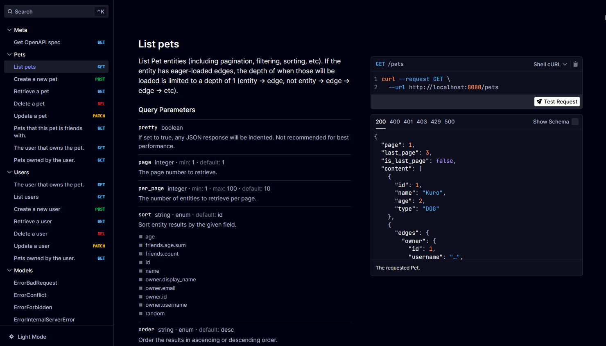

import { Code } from '@astrojs/starlight/components';

Now that you've got a basic HTTP API setup, you can start making API requests to it.

### API Documentation

You should now be able to access the API docs at [http://localhost:8080/docs](http://localhost:8080/docs), which should display a nice UI for exploring the API, and executing sample requests:



### Sample Requests with Curl

Here are a few sample requests that you can execute with [curl](https://curl.se/).

##### Create a new user (note the `id` field in the response, we'll use that in further requests)

```bash
curl --request POST \
  --url 'http://localhost:8080/users?pretty=true' \
  --header 'Content-Type: application/json' \
  --data '{
  "username": "lrstanley",
  "display_name": "Liam Stanley",
  "email": "lrstanley@example.com"
}'
```

<Code code={`
{
    "id": 4294967297,
    "username": "lrstanley",
    "display_name": "Liam Stanley",
    "email": "lrstanley@example.com",
    "edges": {}
}
`} lang="json" frame="none" class="code-output" mark="4294967297" />

##### Create a new pet who is owned by the user we just created

```bash mark="4294967297"
curl --request POST \
  --url 'http://localhost:8080/pets?pretty=true' \
  --header 'Content-Type: application/json' \
  --data '{
  "name": "Riley",
  "age": 2,
  "type": "DOG",
  "owner": 4294967297
}'
```

<Code code={`
{
    "id": 1,
    "name": "Riley",
    "age": 2,
    "type": "DOG",
    "edges": {
        "owner": {
            "id": 4294967297,
            "username": "lrstanley",
            "display_name": "Liam Stanley",
            "email": "lrstanley@example.com",
            "edges": {}
        }
    }
}
`} lang="json" frame="none" class="code-output" />

Notice that the response includes the `edges` field. This is because we've added the `owner` edge to
be eager-loaded in the schema, as shown below:

```go title="internal/database/schema/pet.go" ins={9}
func (Pet) Edges() []ent.Edge {
    return []ent.Edge{
        // [...]
        edge.From("owner", User.Type).
            Ref("pets").
            Unique().
            Comment("The user that owns the pet.").
            Annotations(
                entrest.WithEagerLoad(true),
                entrest.WithFilter(entrest.FilterEdge),
            ),
        // [...]
    }
}
```

##### Now query the pets that the user owns

This uses the auto-generated edge endpoint on the `User` schema.

```bash mark="4294967297"
curl --request GET \
  --url 'http://localhost:8080/users/4294967297/pets?pretty=true'
```

<Code code={`
{
    "page": 1,
    "total_count": 1,
    "last_page": 1,
    "is_last_page": true,
    "content": [
        {
            "id": 1,
            "name": "Riley",
            "age": 2,
            "type": "DOG",
            "edges": {
                "owner": {
                    "id": 4294967297,
                    "username": "lrstanley",
                    "display_name": "Liam Stanley",
                    "email": "lrstanley@example.com",
                    "edges": {}
                }
            }
        }
    ]
}
`} lang="json" frame="none" class="code-output" />
