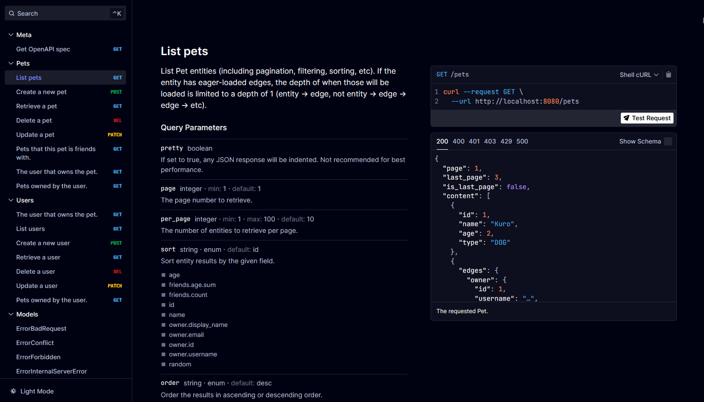

import { Code } from '@astrojs/starlight/components';

When [`entrest.Config.DisableSpecHandler`](https://pkg.go.dev/github.com/lrstanley/entrest#Config) is **false**
at generation time, entrest embeds the OpenAPI spec in your generated `rest` package and registers two
discovery endpoints on the running server:

| Route | Purpose |
| --- | --- |
| `GET {BasePath}/openapi.json` | OpenAPI 3 JSON document |
| `GET {BasePath}/docs` | Embedded interactive reference UI ([Scalar](https://github.com/scalar/scalar)) |

With the stdlib handler, a `GET` of `/` (after `BasePath` is stripped) redirects to `/docs` when both
endpoints are enabled. See [Configuration](./configuration/#base-url-and-path) for
how `BaseURL` and `BasePath` affect these URLs.



Runtime toggles (`DisableSpecHandler`, `DisableDocsHandler`, server URL injection, and so on) live on
[`rest.ServerConfig`](./configuration/). This page focuses on what those endpoints
serve and how to replace the default UI with your own.

## OpenAPI spec (`/openapi.json`)

The handler serves the generated spec from an embedded `openapi.json` byte slice. Clients, codegen tools,
and documentation UIs all load this URL.

When `BaseURL` is set and `DisableSpecInjectServer` is false, the handler unmarshals the embedded spec,
adds a `servers` entry if one is not already present, and returns the modified JSON. That lets Scalar,
RapiDoc, and other UIs know where to send try-it-out requests without hard-coding the host in your schema.

If you need the raw embedded bytes without runtime mutation, call `Server.Spec()` from your own code or
disable injection with `DisableSpecInjectServer: true`. Full details are in
[Configuration — OpenAPI spec endpoint](./configuration/#openapi-spec-endpoint).

## Embedded Scalar UI (`/docs`)

The default docs route is implemented by `Server.Docs`. It does not ship a separate static site — it
renders a single inline HTML document on each request using a Go `text/template` and loads Scalar from
the jsDelivr CDN.

:::note
There is no runtime option to tweak Scalar's theme or layout on the embedded `/docs` handler. To change
the UI, disable the embedded docs route and serve your own page (see below).
:::

### Disable the embedded UI

Set `DisableDocsHandler: true` on `ServerConfig` to keep `/openapi.json` but stop registering `/docs` and
the root redirect. This is the starting point for hosting documentation elsewhere or swapping in another
OpenAPI viewer.

<Code lang="go" title="main.go" code={`srv, err := rest.NewServer(db, &rest.ServerConfig{
    DisableDocsHandler: true,
})
if err != nil {
    panic(err)
}

http.ListenAndServe(":8080", srv.Handler())`} />

`DisableDocsHandler` has no effect when `DisableSpecHandler` is already true.

## Custom documentation UI

Any OpenAPI viewer that accepts a spec URL can replace the embedded Scalar page. Typical steps:

1. Set `DisableDocsHandler: true` so `/docs` is not registered by the generated handler.
2. Keep `/openapi.json` enabled (unless you serve the spec from another origin).
3. Register your own `GET` handler that returns a single HTML document.
4. Point the viewer at `{BasePath}/openapi.json` (or an absolute URL if the UI is on another host).

The examples below mount custom docs at the same `/v1/docs` path using an outer `http.ServeMux`. With
chi, mount `rapidocDocs` on the router before calling `srv.Handler(r)` inside your `/v1` route.

### RapiDoc (inline HTML + CDN)

[RapiDoc](https://rapidocweb.com/) is a web component that renders OpenAPI 3 specs. This example serves
one self-contained HTML page from Go with `fmt.Fprintf`, loads RapiDoc from the unpkg CDN, and overrides
component attributes for a focused dark layout instead of using the embedded Scalar handler.

```go title="main.go"
// [...]

func rapidocDocs(baseURL string) http.HandlerFunc {
    return func(w http.ResponseWriter, r *http.Request) {
        uri := strings.TrimSuffix(baseURL, "/")

        w.Header().Set("Content-Type", "text/html")
        w.WriteHeader(http.StatusOK)
        fmt.Fprintf(w, `<!doctype html>
<html>
<head>
  <meta charset="utf-8">
  <meta name="referrer" content="no-referrer">
  <script type="module" src="https://unpkg.com/rapidoc@9.3.8/dist/rapidoc-min.js"></script>
  <title>Pet Store API</title>
</head>
<body>
  <rapi-doc
    allow-server-selection="false"
    bg-color="#18181C"
    fill-request-fields-with-example="false"
    font-size="large"
    layout="row"
    load-fonts="false"
    mono-font="Consolas, monaco, monospace"
    nav-bg-color="#0F0F0F"
    nav-hover-bg-color="#1B1B1B"
    primary-color="#10B981"
    regular-font="Consolas, monaco, monospace"
    render-style="focused"
    schema-description-expanded="true"
    show-curl-before-try="true"
    show-header="false"
    show-method-in-nav-bar="as-colored-text"
    spec-url=%q
    text-color="#BBBBBB"
    theme="dark"
    use-path-in-nav-bar="true"
    persist-auth="true"
  ></rapi-doc>
</body>
</html>`, uri+"/openapi.json")
    }
}

func main() {
    // [...]

    mux := http.NewServeMux()
    mux.HandleFunc("GET /v1/docs{$}", rapidocDocs(cfg.BaseURL))
    mux.Handle("/", srv.Handler())

    log.Fatal(http.ListenAndServe(":8080", mux))
}
```
