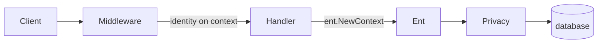

import { CardGrid, Code, LinkCard } from '@astrojs/starlight/components';

:::note[How-to guide]
entrest does not ship login flows, session stores, or role models. You authenticate requests in HTTP
middleware, enforce access with [Ent privacy policies](https://entgo.io/docs/privacy/), and use
generation-time annotations to limit what the API exposes.
:::

## Overview

A typical setup has two layers:

1. **Authentication** — HTTP middleware validates credentials (JWT, session cookie, API key, etc.) and
   stores the caller's identity on the request context.
2. **Authorization** — Ent privacy policies read that context on every query and mutation the handler
   runs.

The generated handler injects the `ent.Client` into the request context via `UseEntContext`. Privacy
policies run automatically on handler-driven database calls when the
[`privacy` feature](https://entgo.io/docs/privacy/) is enabled at codegen time.

Return **401 Unauthorized** from middleware when credentials are missing or invalid. Reserve
**403 Forbidden** for requests that are authenticated but not allowed by a privacy policy.

## Authentication middleware

Validate the request before it reaches the generated handler and attach whatever your privacy rules
need — user ID, roles, tenant ID, and so on.

<Code lang="go" title="auth/middleware.go" code={`type contextKey int

const userKey contextKey = iota

type User struct {
    ID   int
    Role string
}

func UserFromContext(ctx context.Context) (*User, bool) {
    u, ok := ctx.Value(userKey).(*User)
    return u, ok
}

func WithUser(ctx context.Context, u *User) context.Context {
    return context.WithValue(ctx, userKey, u)
}

func AuthMiddleware(next http.Handler) http.Handler {
    return http.HandlerFunc(func(w http.ResponseWriter, r *http.Request) {
        token := strings.TrimPrefix(r.Header.Get("Authorization"), "Bearer ")
        if token == "" {
            http.Error(w, "missing credentials", http.StatusUnauthorized)
            return
        }

        user, err := validateToken(token)
        if err != nil {
            http.Error(w, "invalid credentials", http.StatusUnauthorized)
            return
        }

        next.ServeHTTP(w, r.WithContext(WithUser(r.Context(), user)))
    })
}`} />

Mount middleware **outside** the generated handler so every route — including custom ones you add
alongside entrest — sees the same context:

<Code lang="go" title="main.go" code={`srv, err := rest.NewServer(db, nil)
if err != nil {
    panic(err)
}

handler := AuthMiddleware(srv.Handler())
http.ListenAndServe(":8080", handler)`} />

With chi, apply middleware on the router before calling `srv.Handler(r)` — see
[Configuration — Stdlib vs chi](/entrest/http-handler/configuration/#stdlib-vs-chi).

You do not need to call `UseEntContext` yourself when using the generated handler — it wraps the mux
for you. Only register it separately if another handler needs the client on requests that never reach
`Server.Handler` — see [Configuration — Ent client context](/entrest/http-handler/configuration/#ent-client-context).

## Authorization with privacy policies

Enable the privacy feature at codegen time (`gen.FeaturePrivacy`) and implement `Policy()` on schemas
that need access control. Policy design — rules, filters, row-level scoping, role checks — is covered
in the [Ent privacy documentation](https://entgo.io/docs/privacy/).

From entrest's perspective, the important part is that policies read the same context values your
middleware sets. A minimal example: public reads, authenticated writes.

<Code lang="go" title="schema/schema_post_policy.go" code={`func (Post) Policy() ent.Policy {
    return privacy.Policy{
        Query: privacy.QueryPolicy{
            privacy.AlwaysAllowRule(),
        },
        Mutation: privacy.MutationPolicy{
            privacy.ContextQueryMutationRule(func(ctx context.Context) error {
                if _, ok := UserFromContext(ctx); ok {
                    // You could run additional queries here to validate permissions,
                    // check info from the context on what the users role may be,
                    // and/or use advanced privacy features (documented in the Ent
                    // privacy docs), which allow filtering down resources, (e.g.
                    // only showing public blog posts unless the user is an admin).
                    return privacy.Allow
                }
                return privacy.Skip
            }),
            privacy.AlwaysDenyRule(),
        },
    }
}`} />

The handler does not know about your auth model — it runs Ent queries with the request context, and
privacy policies decide what is allowed.

:::caution[Running internal ent queries when using privacy policies]
Note that when adding privacy policies like this, typical backend non-user-driven queries will
now begin to fail, because the context does not have the associated authenticated user information.
As such, there are typically 2 approaches to resolve this:

1. Inject a privacy.Allow [decision context override](https://entgo.io/docs/privacy/#decision-context)
   into the context, which the Ent privacy layer will honor.
2. Create a `SYSTEM` user (as an example), which is considered the author of all system-driven queries,
   and is what becomes associated in your database (if you use the invoked user as authors or similar).
:::

## Handler error mapping

When a privacy rule returns `privacy.Deny`, the generated `DefaultErrorHandler` responds with
**403 Forbidden** and the standard error envelope. See
[Configuration — Error handling](/entrest/http-handler/configuration/#error-handling).

| Source | Typical status |
| --- | --- |
| Auth middleware — missing or invalid credentials | 401 |
| Privacy policy — `privacy.Deny` | 403 |
| Row not found after policy filtering | 404 |

Set `MaskErrors` in production so internal policy messages do not leak to clients.

## Limit what the API exposes

Privacy policies run at the database layer. Annotations and Ent field options shrink the attack
surface at generation time.

Mark secrets with Ent's `Sensitive()` so they are omitted from JSON responses and the OpenAPI spec.
Use [`entrest.WithSkip`](/entrest/openapi-specs/annotation-reference/#withskip) when a field should never
appear in the REST API but is not marked sensitive.

[`entrest.WithReadOnly`](/entrest/openapi-specs/annotation-reference/#withreadonly) keeps a field out of
create/update bodies. [`entrest.WithIncludeOperations`](/entrest/openapi-specs/annotation-reference/#withincludeoperations)
and [`entrest.WithExcludeOperations`](/entrest/openapi-specs/annotation-reference/#withexcludeoperations)
control which CRUD endpoints exist — useful for admin-only schemas or edges clients should not
reassign:

<Code lang="go" title="schema/schema_post.go" code={`edge.From("author", User.Type).
    Ref("posts").
    Unique().
    Required().
    Annotations(
        entrest.WithExcludeOperations(
            entrest.OperationCreate,
            entrest.OperationUpdate,
        ),
    )`} />

Set the author in an Ent hook or default instead of letting clients pick any user ID.

[`entrest.WithAllowClientIDs`](/entrest/openapi-specs/annotation-reference/#withallowclientids) and
[`entrest.Config.AllowClientIDs`](https://pkg.go.dev/github.com/lrstanley/entrest#Config) let
clients send an `id` on create. Only enable this with validation — a deleted resource recreated
with the same ID can otherwise be hijacked.

## Document security in OpenAPI

Authentication headers belong in OpenAPI **security schemes**, not
[`GlobalRequestHeaders`](https://pkg.go.dev/github.com/lrstanley/entrest#Config). Add schemes through
a base spec via [`SpecFromPath`](/entrest/openapi-specs/extending/#specfrompath) or
[`Spec`](/entrest/openapi-specs/extending/#spec-configuration-option):

<Code lang="go" title="base-openapi.json" code={`{
  "components": {
    "securitySchemes": {
      "bearerAuth": {
        "type": "http",
        "scheme": "bearer",
        "bearerFormat": "JWT"
      }
    }
  },
  "security": [{ "bearerAuth": [] }]
}`} />

entrest merges this into the generated spec. [`DefaultErrorResponses`](https://pkg.go.dev/github.com/lrstanley/entrest#DefaultErrorResponses)
already documents **401** and **403** on operations. The embedded `/docs` UI supports
`persistAuth` when you use the default Scalar handler — see [API Docs](/entrest/http-handler/api-docs/).

Declaring a scheme in the spec does not enforce it. Middleware and privacy policies do.

## Background and internal calls

Privacy policies also apply to code that never goes through HTTP — migrations, workers, startup
seeding. Use `privacy.DecisionContext(ctx, privacy.Allow)` to bypass checks for trusted internal
work. See the [Ent privacy docs](https://entgo.io/docs/privacy/#context-decision).

## Testing

Wrap the handler the same way production does, then seed context through middleware or call the API
with credentials:

<Code lang="go" title="handler_test.go" code={`func authAs(user *User, next http.Handler) http.Handler {
    return http.HandlerFunc(func(w http.ResponseWriter, r *http.Request) {
        next.ServeHTTP(w, r.WithContext(WithUser(r.Context(), user)))
    })
}

func TestCreatePostRequiresAuth(t *testing.T) {
    ctx := context.Background()
    db := enttest.Open(t, "sqlite3", "file:ent?mode=memory&cache=shared&_pragma=foreign_keys(1)")
    t.Cleanup(func() { db.Close() })

    srv, err := rest.NewServer(db, nil)
    require.NoError(t, err)

    ts := enttest.WithExisting(t, authAs(&User{ID: 1, Role: "admin"}, srv.Handler()))

    resp := ts.Request[ent.Post](ctx, http.MethodPost, "/posts", map[string]any{
        "title": "hello world",
        "body":  "content here",
    }).Must(t)
    assert.Equal(t, http.StatusCreated, resp.Data.Code)
}`} />

To assert a denial, skip `.Must(t)` and check `resp.Error.Code` — see
[Testing — Success and failure](/entrest/http-handler/testing/#success-and-failure).

## Related

<CardGrid>
    <LinkCard
        title="Ent privacy"
        description="Policy design, rules, and filters."
        href="https://entgo.io/docs/privacy/"
    />
    <LinkCard
        title="Runtime Configuration"
        description="Error handling, UseEntContext, and chi mounts."
        href="/entrest/http-handler/configuration/"
    />
    <LinkCard
        title="Testing"
        description="enttest request helpers."
        href="/entrest/http-handler/testing/"
    />
    <LinkCard
        title="Annotation reference"
        description="WithSkip, operations, and read-only fields."
        href="/entrest/openapi-specs/annotation-reference/"
    />
    <LinkCard
        title="Extending the spec"
        description="Base OpenAPI spec and security schemes."
        href="/entrest/openapi-specs/extending/"
    />
</CardGrid>
