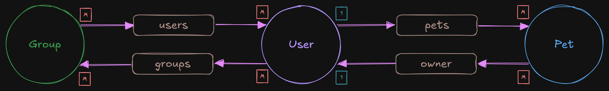

:::tip
Before getting started with eager-loading specific functionality in entrest, it is recommended to read
through the [EntGo Edges](https://entgo.io/docs/schema-edges) documentation, as well as the
[EntGo Eager Loading](https://entgo.io/docs/eager-load) documentation.
:::

We will use the following example schema in our walk-through, which contains a few different edges:




### What is eager loading?

Eager loading is a feature in EntGo that allows you to eager-load edges on a query, which means that
the edges are fetched along with the parent entity. This is primarily useful when you have a a parent
entity, like a `Pet`, and you are confident that you always want to fetch the associated owner of that
pet (the `owner` type, which is a `User`).

In entrest, we build upon this functionality -- to start, all edges by default will have a dedicated
endpoint where you can query an entities associated edges -- these are called **edge endpoints**:

- Unique edge example: `GET /pets/{id}/owner`
- Non-unique edge example: `GET /users/{id}/pets`

### Usage

If you enable eager-loading for an edge, say the `owner` edge on the `Pet` schema using the
[`WithEagerLoad`](/entrest/openapi-specs/annotation-reference/#witheagerload) annotation,
calling `GET /pets/{id}` would return something like this:

```json
{
    "id": 1,
    "name": "Riley",
    "age": 2,
    "type": "DOG",
    "edges": {
        "owner": {
            "id": 4294967297,
            "username": "lrstanley",
            "display_name": "Liam Stanley",
            "email": "lrstanley@example.com",
            "edges": {}
        }
    }
}
```

And the associated code required:

```go title="internal/database/schema/schema_pet.go" ins={4}
func (Pet) Edges() []ent.Edge {
    return []ent.Edge{
        edge.To("owner", User.Type).Annotations(
            entrest.WithEagerLoad(true),
        ),
    }
}
```

### Additional configuration

- If you eager load an edge, by default the associated edge endpoint will have its pagination turned off.
  This can be turned off with the config option [`DisableEagerLoadNonPagedOpt`](https://pkg.go.dev/github.com/lrstanley/entrest#Config.DisableEagerLoadedEndpoints).
- If you only ever want to eager load a specific edge and not have a dedicated endpoint, you can use
  the [`WithEdgeEndpoint`](/entrest/openapi-specs/annotation-reference/#withedgeendpoint) annotation
  to disable the edge endpoint. This can also be configured globally with the config option
  [`DisableEagerLoadedEndpoints`](https://pkg.go.dev/github.com/lrstanley/entrest#Config.DisableEagerLoadedEndpoints).
- All edges can be eager loaded by default (though highly discouraged). See the config option
  [`DefaultEagerLoad`](https://pkg.go.dev/github.com/lrstanley/entrest#Config.DefaultEagerLoad).

### When should you not eager load?

Eager loading is a very powerful feature, but it can also be very expensive. For example, if you have
a `User` schema, and an edge **which may have** 1000+ associated entities, eager loading will never
be paginated, so it must always fetch all of the associated entities. Eager loading should only be used
when you are confident that the associated entities will not scale to a large number of entities in almost
all cases.

It's also worth noting that this could be used as an attack vector (i.e. denial-of-service and/or resource-exhaustion).
If a user is in control of an association, and intentionally adds additional entities to the association,
they could overwhelm consumers of your API (response times, memory usage, total response sizes, etc).

### Examples of good and bad eager loading

- Eager loading the `owner` edge on the `Pet` schema: ✔️
  - As long as the `owner` edge does not grow to have an extremely large amount of fields, this is
    relatively safe.
- Eager loading the `friends` edge on the `Pet` schema: ❌
  - As this field is likely user-controlled, this _could_ result in an unknown amount of entities being
    fetched, and it is likely a field that is hard to add a limit to.
- Eager loading a `notifications` edge on the `User` schema: ✔️
  - Even though `notifications` to some extent are likely user-controlled, it's something that you could
    add a limit to (e.g. a given user can only have 200 historical notifications).
