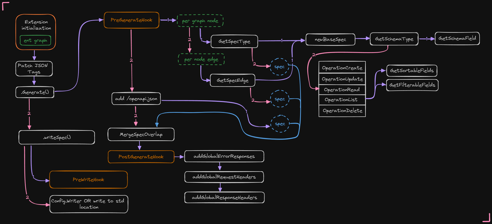
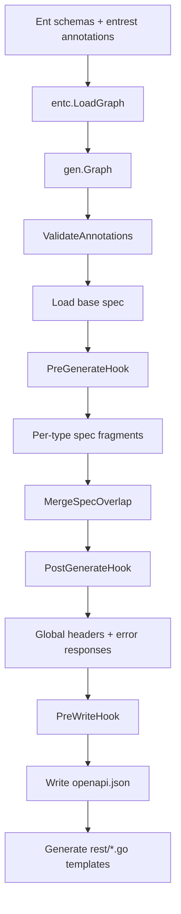
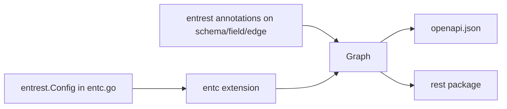

:::note[Explanation]
How entrest generates OpenAPI specs and HTTP handlers at `go generate` time. For runtime handler
behavior, see [Runtime Configuration](/entrest/http-handler/configuration/). For codegen options,
see [Codegen Configuration](/entrest/openapi-specs/configuration/).
:::

entrest is an [entc extension](https://entgo.io/docs/code-gen/#extensions). You register it in
`entc.go` with `entc.Extensions(entrest.NewExtension(...))`. When you run `go generate`, entrest
runs alongside Ent's own codegen and writes artifacts under your Ent target directory (typically
`<ent>/rest/`).



## Codegen pipeline

At a high level, generation happens in three phases: prepare the graph, build and merge the OpenAPI
spec, then emit handler templates.



### 1. Graph preparation

Ent loads your schema files into a `*gen.Graph`. entrest registers two entc hooks:

1. **JSON tag patch** (unless [`DisablePatchJSONTag`](/entrest/openapi-specs/configuration/#json-response-bodies)
   is set) — removes `omitempty` from generated struct tags so default-valued fields still appear in
   JSON responses.
2. **Spec and handler generation** — the main `Generate` pass described below.

Before any paths are built, [`ValidateAnnotations`](https://pkg.go.dev/github.com/lrstanley/entrest#ValidateAnnotations)
checks that each `entrest` annotation is attached at the correct level (schema, field, or edge).
Misplaced annotations fail codegen immediately with a message naming the field and allowed locations.

### 2. OpenAPI spec generation

For each schema node in the graph:

1. **Skip** schemas (or edges) marked with [`WithSkip`](/entrest/openapi-specs/annotation-reference/#withskip)
   or with zero allowed operations.
2. **Entity operations** — for each allowed CRUD operation (`create`, `read`, `update`, `delete`,
   `list`), build a spec fragment via `GetSpecType`. Schemas without an explicit `id` field only get
   `list` and `create`.
3. **Edge endpoints** — for edges with an ID (composite/through edges are skipped), generate list or
   read fragments via `GetSpecEdge` when [`WithEdgeEndpoint`](/entrest/openapi-specs/annotation-reference/#withedgeendpoint)
   allows it.
4. Unless [`DisableSpecHandler`](/entrest/openapi-specs/configuration/#handler-generation-and-spec-output)
   is set, append a `GET /openapi.json` meta endpoint.

Each fragment is a small `ogen.Spec` containing paths and `components` for one operation. All
fragments are merged into a **base spec** using overlap merge (`MergeSpecOverlap`): paths with the
same URL combine HTTP methods; component map keys from later fragments win on conflict.

#### Base spec sources

The merge target is chosen in this order:

| Source | Config field |
| --- | --- |
| In-memory spec | [`Config.Spec`](https://pkg.go.dev/github.com/lrstanley/entrest#Config.Spec) |
| JSON file on disk | [`Config.SpecFromPath`](https://pkg.go.dev/github.com/lrstanley/entrest#Config.SpecFromPath) |
| Empty spec | Default `openapi: 3.0.3`, `info.title: EntGo Rest API`, `info.version: 1.0.0` |

You cannot set both `Spec` and `SpecFromPath`. See [Extending the Spec](/entrest/openapi-specs/extending/)
for adding custom paths, security schemes, and metadata.

#### Global enrichment (after merge)

These run **after** [`PostGenerateHook`](/entrest/openapi-specs/extending/#pregeneratehook-and-postgeneratehook)
and before the spec is written:

- [`GlobalErrorResponses`](/entrest/openapi-specs/configuration/#headers-and-error-responses)
- [`GlobalRequestHeaders`](/entrest/openapi-specs/configuration/#headers-and-error-responses)
- [`GlobalResponseHeaders`](/entrest/openapi-specs/configuration/#headers-and-error-responses)

Custom paths added in `PreGenerateHook` receive globals automatically. Paths added in
`PostGenerateHook` also receive them because globals are applied after that hook.

[`PreWriteHook`](/entrest/openapi-specs/extending/#pregeneratehook-and-postgeneratehook) runs last —
after globals — and receives only the finished `*ogen.Spec` (no graph access).

The final document is written to `<ent-target>/rest/openapi.json` unless you set a custom
[`Writer`](https://pkg.go.dev/github.com/lrstanley/entrest#Config.Writer).

### 3. Handler generation

When [`Config.Handler`](https://pkg.go.dev/github.com/lrstanley/entrest#Config.Handler) is not
`HandlerNone`, entc renders Go templates into `<ent-target>/rest/`:

| File | Purpose |
| --- | --- |
| `server.go` | `NewServer`, route registration, `/openapi.json`, `/docs` |
| `create.go`, `list.go`, `update.go`, … | Per-operation handler functions |
| `sorting.go`, `eagerload.go`, `optional.go` | Query helpers |

[`WithTesting`](/entrest/http-handler/testing/) adds request helpers under `<ent-target>/enttest/`.
`HandlerNone` generates only the spec — no handler package.

## Config vs annotations

entrest uses two configuration layers that resolve at codegen time:



### Global: `entrest.Config`

Passed to `entrest.NewExtension(&entrest.Config{...})` in `entc.go`. Controls defaults for every
schema — pagination bounds, eager-load policy, default CRUD operations, handler router type
(`HandlerStdlib`, `HandlerChi`, or `HandlerNone`), global headers/errors, hooks, and more.

See [Codegen Configuration](/entrest/openapi-specs/configuration/) for the full field list.

### Per-entity: `entrest` annotations

Attached on schemas, fields, and edges via `entrest.With...()` in your Ent schema files. Examples:
`WithSkip`, `WithEagerLoad`, `WithFilter`, `WithPagination`.

**Precedence** is generally: edge annotation → parent schema annotation → `Config` default. For
example, [`WithExcludeOperations`](/entrest/openapi-specs/annotation-reference/#withexcludeoperations)
on an edge overrides the parent schema's operation set.

See [Annotation Reference](/entrest/openapi-specs/annotation-reference/) for every annotation and
its allowed attachment point.

### Runtime: `rest.ServerConfig`

Separate from codegen. Configured when you call `rest.NewServer(db, cfg)` in `main.go`. Controls
mount paths, body size limits, error masking, and docs/spec serving at **runtime**. The generated
handler code is already fixed; `ServerConfig` only changes how the running server behaves.

See [Runtime Configuration](/entrest/http-handler/configuration/).

## Generated artifacts

After `go generate`, a typical project contains:

```
internal/database/ent/
├── ...                    # standard Ent generated code
└── rest/
    ├── openapi.json       # merged OpenAPI 3.0.3 spec
    ├── server.go          # route registration + Server type
    ├── create.go
    ├── list.go
    └── ...
```

The embedded `openapi.json` is also available as `rest.OpenAPI` bytes in the generated package.
When spec serving is enabled, the handler exposes it at `GET {BasePath}/openapi.json`.

## Path naming

Generated REST paths follow consistent conventions:

| Pattern | Example |
| --- | --- |
| List / create | `/users`, `/pets` |
| Read / update / delete | `/users/{userID}`, `/pets/{petID}` |
| Edge list | `/users/{userID}/pets` |
| Edge read (unique) | `/pets/{petID}/owner` |

Entity segments use kebab-case plurals. Path parameters use camelCase entity name + `ID`
(for example `{userID}`).

## Related pages

- [Codegen Configuration](/entrest/openapi-specs/configuration/) — `entrest.Config` fields
- [Extending the Spec](/entrest/openapi-specs/extending/) — base spec, hooks, security schemes
- [Annotation Reference](/entrest/openapi-specs/annotation-reference/) — per-schema overrides
- [Mount the Handler](/entrest/http-handler/getting-started/) — wiring the generated `rest` package
- [Troubleshooting](/entrest/resources/troubleshooting/) — common codegen and runtime errors
